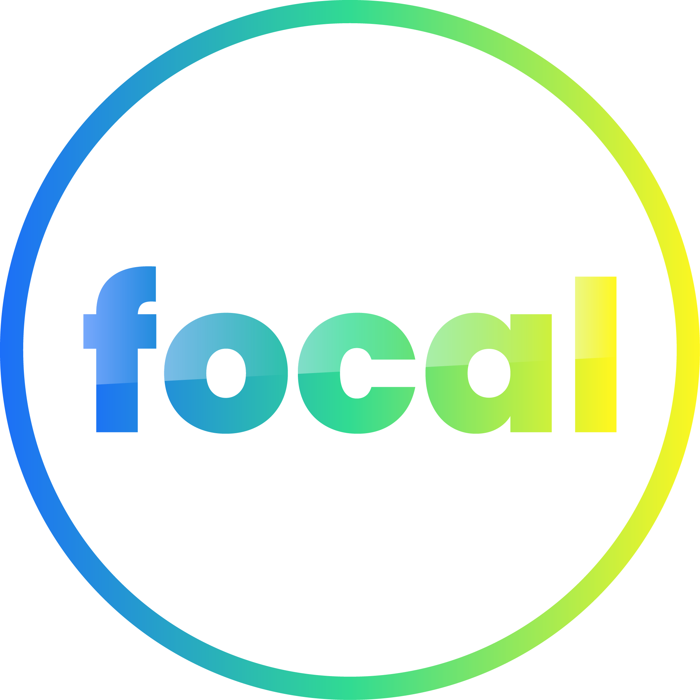

[](LICENSE)
[](https://nextjs.org/)
[](https://www.typescriptlang.org/)
[](https://tailwindcss.com/)

# Focal Landing

A premium, cinematic landing page for **Focal Shipping Services LLC** — a leading maritime agency and logistics provider based in Dubai, UAE.



## About

Focal Landing is an immersive, scroll-driven web experience that showcases the complete maritime journey of a vessel — from ocean approach through harbor entry to inland distribution. Built with cutting-edge web technologies, it delivers a cinematic storytelling experience while highlighting Focal's comprehensive shipping services.

### Key Features

- **Cinematic Scroll Animations** — Frame-by-frame canvas rendering with smooth crossfade transitions
- **Responsive Design** — Seamless experience across desktop, tablet, and mobile devices
- **Interactive Service Catalog** — 10 maritime services with detailed modal views
- **Global Port Network** — Showcases operations across UAE, Singapore, Turkey, Netherlands, Belgium, and USA
- **24/7 Operational Badge** — Real-time status indicator for continuous service availability
- **ISO Compliance Display** — Quality management certifications (ISO 9001:2015, ISO 14001:2015)
- **Contact Form** — Port clearance enquiry form for vessel support requests

## Tech Stack

| Technology | Version | Purpose |
|------------|---------|---------|
| Next.js | 16.2.9 | React framework with App Router |
| React | 19.2.4 | UI library |
| TypeScript | 5.x | Type safety |
| Tailwind CSS | 4.x | Utility-first styling |
| Lucide React | 1.21.0 | Icon library |

## Getting Started

### Prerequisites

- **Node.js** 18.0 or later
- **npm**, **yarn**, or **pnpm** package manager

### Installation

1. Clone the repository:

```bash
git clone https://github.com/muhammad-shameel-ks/focal_landing.git
cd focal_landing
```

2. Install dependencies:

```bash
npm install
# or
yarn install
# or
pnpm install
```

3. Start the development server:

```bash
npm run dev
# or
yarn dev
# or
pnpm dev
```

4. Open [http://localhost:3000](http://localhost:3000) in your browser.

## Available Scripts

| Command | Description |
|---------|-------------|
| `npm run dev` | Start development server |
| `npm run build` | Create production build |
| `npm run start` | Start production server |
| `npm run lint` | Run ESLint checks |

## Project Structure

```
focal_landing/
├── app/
│   ├── components/
│   │   └── FocalJourney.tsx    # Main landing page component
│   ├── globals.css             # Global styles
│   ├── icon.png               # App icon
│   ├── layout.tsx             # Root layout
│   └── page.tsx               # Home page
├── public/
│   └── frames/                # Animation frame assets
├── package.json
├── tsconfig.json
├── next.config.ts
├── postcss.config.mjs
└── eslint.config.mjs
```

## Environment Variables

This project does not currently require any environment variables. The `.gitignore` is configured to exclude `.env*` files for future use.

## Contributing

Contributions are welcome! Please follow these steps:

1. **Fork** the repository
2. **Create** a feature branch (`git checkout -b feature/amazing-feature`)
3. **Commit** your changes (`git commit -m 'Add amazing feature'`)
4. **Push** to the branch (`git push origin feature/amazing-feature`)
5. **Open** a Pull Request

### Development Guidelines

- Follow the existing code style and conventions
- Use TypeScript for all new components
- Ensure responsive design across all breakpoints
- Test changes on multiple browsers before submitting
- Run `npm run lint` to check for code quality issues

## Services Highlighted

Focal provides comprehensive maritime services including:

- **Ship Agency Services** — Full port coordination and vessel clearance
- **Husbandry Services** — Operational and non-cargo vessel requirements
- **Logistics & Supply Chain** — Multi-modal forwarding and customs clearance
- **Marine Survey Services** — Independent inspections and damage assessments
- **Crew Management** — Visa processing, medical support, and rotation management
- **Bunkering Coordination** — Fuel and lubricant supply management
- **Store Supplies** — Marine deck, engine, and safety store items
- **Provisions Supplies** — Fresh, frozen, and dry food provisions
- **Spare Parts Delivery** — Time-critical marine spares delivery
- **Cash to Master** — Secure currency delivery to vessel captains

## License

This project is licensed under the MIT License — see the [LICENSE](LICENSE) file for details.

## Contact

**Focal Shipping Services LLC**  
Dubai, UAE  
ISO 9001:2015 | ISO 14001:2015

---

Built with precision for the maritime industry.
